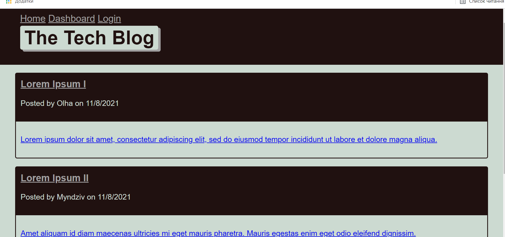

# Tech_Blog

## User Story

AS A developer who writes about tech
I WANT a CMS-style blog site
SO THAT I can publish articles, blog posts, and my thoughts and opinions.

## General Info
The app follows the MVC paradigm in its architectural structure, using Handlebars.js as the templating language, Sequelize as the ORM, and the express-session npm package for authentication.[Link to deployed application](https://powerful-taiga-04639.herokuapp.com/)

Image showcasing the application 

## Technologies
Project is created with 
* [Javascript](https://www.javascript.com/)
* [Node.js](https://nodejs.org/en/)
* [Sequelize](https://www.npmjs.com/package/sequelize)
* [MySQL2](https://www.npmjs.com/package/mysql2)
* [Express](https://www.npmjs.com/package/express)
* [Dotenv](https://www.npmjs.com/package/dotenv)
* [connect-session-sequelize](https://www.npmjs.com/package/connect-session-sequelize)
* [Express-Handlebars](https://www.npmjs.com/package/express-handlebars)
* [bcrypt](https://www.npmjs.com/package/bcrypt)
